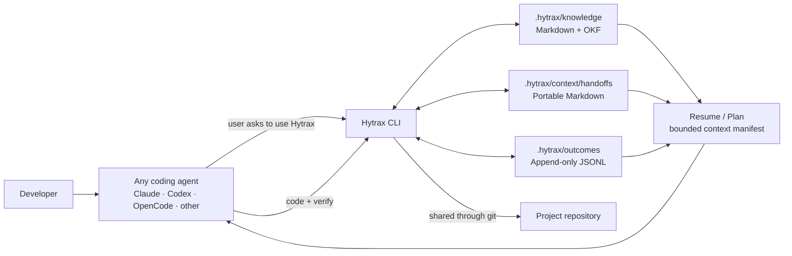

# Hytrax

**Local, deterministic knowledge layer for AI coding agents.**
**Makes your agent stop repeating the same mistakes.**

```bash
npm install -D hytrax@alpha
npx hytrax init
npx hytrax plan "add user authentication"
```

## How to use

1. Work normally with your AI agent.
2. Before switching agents, ask: **“Use Hytrax and save the context.”**
3. In the next agent, ask: **“Use Hytrax and continue.”**

Setup once per project:

```bash
npx hytrax init --agent-instructions
```

That is all. The agent will use `hytrax resume` and create handoffs when you ask.

Hytrax has **no LLM of its own** — the host agent's LLM does all reasoning.
It's a CLI tool that stores structured project knowledge as flat files in `.hytrax/`,
committed to git and shared by every developer + CI on your team.

## Where Hytrax Wins

Hytrax is for teams that must review and enforce what an agent learns. Knowledge is
plain Markdown in the pull request, inactive rules stop appearing in plans, and CI can
run `npx hytrax validate --strict` to reject stale generated constraints or broken file
links. It is deliberately not a semantic-search or autonomous-memory replacement.

## Portable Context Handoffs

When moving between Claude Code, Codex, OpenCode, Cursor, Copilot, or any other
agentic coding platform, save the current work as a portable handoff:

```bash
npx hytrax handoff template > HANDOFF.md
# Have the current agent fill in Goal, Decisions, Risks, and Next actions.
npx hytrax handoff create --input HANDOFF.md
# Or pipe a generated handoff directly:
some-agent-command | npx hytrax handoff create --stdin --source-agent opencode
```

Start the next agent with the bounded context manifest:

```bash
npx hytrax resume "finish the OAuth callback"
```

The resume output combines the best open handoff, active constraints, relevant
knowledge, past outcomes, and verification steps. It is deterministic, valid YAML,
and capped by `--max-chars`, so an eight-hour transcript does not become an eight-hour prompt.

---

## Why Hytrax Exists

AI coding agents have **no memory between sessions**. Every task is a cold start:

1. Agent builds a feature → it works
2. You tell it "use Tailwind, not plain CSS"
3. Next task → agent uses plain CSS again
4. You tell it again. Forever.

Hytrax fixes this by giving agents **deterministic access to past knowledge**:
what was decided, what failed, what patterns are approved, what rules must be followed.

No vector database. No embeddings. No SQLite. No daemon. No MCP server.
Just structured files and a CLI.

---

## Architecture



Hytrax stores context locally and deterministically. The agent remains responsible
for reasoning and code; Git makes the saved context available to the next agent.

---

## How It Works

```
┌───────────────────────────────────────────────────────────┐
│                    HY TRAX KNOWLEDGE LOOP                  │
│                                                           │
│   Task assigned to AI agent                               │
│         │                                                 │
│         ▼                                                 │
│   npx hytrax plan "task"    ← orchestrates 3 searches     │
│         │                      (knowledge + failures +    │
│         ▼                      constraints)               │
│   npx hytrax search "keywords"  ← tag/keyword matching    │
│         │                                                 │
│         ▼                                                 │
│   Agent writes code with full context                     │
│         │                                                 │
│         ▼                                                 │
│   npx hytrax record --build passed  ← stores outcome      │
│                                                           │
│   Next task → plan reads past outcomes → agent learns     │
└───────────────────────────────────────────────────────────┘
```

Hytrax **owns the data**. The host agent's LLM **owns the intelligence**.

### Agent skill

`npx hytrax init` installs the provider-neutral skill at
`.hytrax/skills/hytrax/SKILL.md`. It teaches agents when to invoke Hytrax without
interrupting normal work: agents work normally, then respond to requests such as
"use Hytrax", "save context", or "switch agents". A later agent resumes only when
the user asks to continue previous work.

### Optional automation

Hytrax is user-triggered by default; it does not run at every session start. If your
agent platform supports lifecycle hooks, you can opt into automatic resume/handoff.
You can also install the same provider-neutral instructions into any platform's file:

```bash
npx hytrax init --agent-instructions AGENTS.md   # Codex, OpenCode and compatible tools
npx hytrax init --agent-instructions CLAUDE.md   # Claude Code
```

Run `npx hytrax record --auto` when desired. It runs the project's `build`, then optional
`lint` and `test` scripts and records verification only.

### When you ask the agent to use Hytrax

1. **Resume** — `npx hytrax resume "<task description>"`
2. **Plan** — `npx hytrax plan "<task description>"` when no useful handoff exists
3. **Work and verify** — use the host project's normal build, test, and lint commands
4. **Handoff** — `npx hytrax handoff create --stdin` before pausing or switching agents
5. **Record** — `npx hytrax record --build passed --task "what I did"`
6. **Add knowledge** — `npx hytrax knowledge add --type constraint --title "Must use Tailwind"`

---

## Open Knowledge Format (OKF) Alignment

Hytrax uses **Google's Open Knowledge Format v0.1** — an open standard for
knowledge-as-markdown. This means your `.hytrax/` folder is portable and can be
consumed by any OKF-compatible tool.

Every knowledge file is a Markdown file (`.md`) with YAML frontmatter — Google's Open Knowledge Format v0.1:

```yaml
---
id: con-01
type: constraint
title: Tailwind Only
description: "Must use Tailwind CSS, no other CSS frameworks"
tags:
  - frontend
  - constraint
files:
  - components/ui/
status: active
timestamp: 2026-07-13T10:00:00Z
---

Never use plain CSS. All styling goes through Tailwind utility classes.
```

**Standard OKF fields:** `type`, `title`, `description`, `resource`, `tags`, `timestamp`
**Hytrax extensions:** `id` (unique), `files` (related paths), `status` (active/deprecated/superseded)

Legacy `summary` field still parsed as fallback for backward compatibility.

---

## CLI Commands

| Command | Purpose |
|---------|---------|
| `hytrax init` | Create `.hytrax/` and install the provider-neutral skill |
| `hytrax init --agent-instructions [file]` | Add or update the workflow in any agent instruction file |
| `hytrax handoff template` | Print the provider-neutral session handoff template |
| `hytrax handoff create --input HANDOFF.md` | Store a validated handoff in `.hytrax/context/handoffs/` |
| `hytrax handoff create --stdin` | Store handoff Markdown piped from any agent or hook |
| `hytrax handoff list` | List open and completed handoffs |
| `hytrax handoff validate --strict` | Validate handoff structure and linked files |
| `hytrax resume "task"` | Assemble bounded context for the next agent |
| `hytrax plan "task"` | Orchestrate searches → produce compressed execution manifest |
| `hytrax search "query"` | Find relevant knowledge + outcomes by tag/keyword |
| `hytrax record --build passed` | Record a task outcome; generated constraints retire when superseded |
| `hytrax record --auto` | Run available package verification scripts and record the result |
| `hytrax query "query"` | Human-readable table view of search results |
| `hytrax validate --strict` | CI check for duplicate IDs, stale generated constraints, and broken links |
| `hytrax stats` | Outcome statistics (acceptance rate, failure rate by area) |
| `hytrax knowledge add --type X --title Y` | Scaffold a new OKF knowledge file |

### Record Command

```bash
# Minimum — records a successful outcome
npx hytrax record --build passed

# Full — captures everything the next agent needs to know
npx hytrax record \
  --build passed \
  --lint passed \
  --tests 42 \
  --task "Add user authentication with Supabase" \
  --approach "Used Supabase Auth with RLS policies" \
  --files "src/lib/auth.ts,src/middleware.ts"
```

On failure, Hytrax **auto-creates a constraint file** with full context — no manual editing needed:

```bash
npx hytrax record --build failed --task "used prop drilling for shared state"

# → Created .hytrax/knowledge/constraints/avoid-used-prop-drilling.md
# → Fully populated with task, reason, and approach
# → AI reads it immediately on next plan
```

### Plan Command Output

The `plan` command produces a compressed YAML manifest with **what to avoid** and **what patterns worked**:

```yaml
task: add dark mode toggle
knowledge:
  - Design System  (architecture)
  - Authentication  (architecture)
avoid:
  - inline styles don't work for theme toggles  (FAILED)
patterns:
  - applied dark:bg-gray-900 Tailwind class to body  (ACCEPTED)
constraints:
  - Tailwind Only
  - No inline styles, use Tailwind classes
verify:
  - build
  - lint
```

This is consumed by the AI agent as a structured prompt prefix —
no parsing, no JSON, just YAML an LLM can read natively.

---

## Project Structure

```
my-project/
├── .hytrax/
│   ├── config.toml              # CLI settings
│   ├── knowledge/
│   │   ├── architecture/        # System architecture + decisions
│   │   │   └── overview.md
│   │   ├── constraints/         # Must-follow rules + auto-generated avoids
│   │   │   └── tailwind-only.md
│   │   ├── patterns/            # Accepted conventions + features
│   │   │   └── landing-page.md
│   │   └── workflows/           # Process workflows
│   │       └── hytrax-loop.md
│   └── outcomes/
│       └── outcomes.jsonl        # Append-only record of past task results
└── node_modules/
    └── hytrax/
```

**Commit this.** Share it with your team. CI runs `hytrax validate` to catch drift.

For protected branches, use the stricter check:

```bash
npx hytrax validate --strict
```

---

## Why Not...

| Approach | Hytrax's Answer |
|----------|----------------|
| **SQLite / DB** | Flat files are fast enough, git-friendly, no schema migration, no daemon. |
| **Vector search / embeddings** | Tags + keywords work. The LLM decides relevance, not cosine similarity. |
| **Daemon / background process** | CLI is zero-infrastructure. No server to run, no port to configure. |
| **MCP server** | CLI works with any agent that can execute commands. Zero protocol lock-in. |
| **Built-in LLM** | Your agent already has one. Don't duplicate it. Stay deterministic. |
| **Agent framework** | Framework-agnostic. Works with Claude Code, Codex, Copilot, OpenCode, Cursor, any agent. |

---

## Kitchen Sink — Full Capabilities

### Search Priority Order (deterministic, no scoring)

When you search, results are ordered by match priority:

1. **Tag match** — query token appears in `tags` field (strongest signal)
2. **Title match** — query token matches document title
3. **Filename match** — query token matches `.md` filename
4. **Description match** — query token matches description text (weakest signal)

This is intentional. Tags are curated by humans. Content is written by AI.
Tags win because humans are better at categorization than LLMs are at writing.

### Outcome Recording Rules

| Build | Lint | Status | Reason |
|-------|------|--------|--------|
| passed | (none) | ACCEPTED | — |
| passed | passed | ACCEPTED | — |
| passed | failed | FAILED | Verification failed |
| failed | (any) | FAILED | Verification failed |
| passed | passed | REJECTED | (user-feedback) |

When `user-feedback` is provided, the outcome is `REJECTED` regardless of verification.

When an ACCEPTED outcome is recorded and a related FAILED outcome exists
(same task, ≥30% keyword overlap), the old failure is **auto-superseded** —
it stops appearing in `plan`'s `avoid:` section. Stats tracks both counts, and its generated constraint is marked `superseded` so future plans stop showing it.

### Knowledge Types

These are conventions, not a closed enum. Add any type you want.

| Type | Subdirectory | Prefix | Purpose |
|------|-------------|--------|---------|
| `architecture` | `architecture/` | `arc-` | System architecture, component relationships |
| `decision` | `architecture/` | `dec-` | Architectural decisions (ADRs) |
| `constraint` | `constraints/` | `con-` | Must-follow rules and non-negotiables |
| `convention` | `patterns/` | `cvn-` | Accepted coding patterns |
| `workflow` | `workflows/` | `wf-` | Process workflows, agent loops |
| `api` | `architecture/` | `api-` | API contracts and endpoints |
| `feature` | `patterns/` | `feat-` | Feature specifications |
| `preference` | `patterns/` | `pref-` | Team preferences, style choices |

---

## Quick Start

```bash
# Install
npm install -D hytrax

# Initialize — creates an empty .hytrax/ store and installs the skill
npx hytrax init

# When you ask your agent to use Hytrax, resume saved context
npx hytrax resume "continue the feature"

# Or plan a new task — surfaces constraints, avoids, patterns
npx hytrax plan "add a new feature"

# Optionally record a result — failures auto-create a constraint
npx hytrax record --build passed --task "added dark mode toggle"
npx hytrax record --build failed --task "used inline styles"
# → Constraint auto-created: .hytrax/knowledge/constraints/avoid-used-inline-styles.md

# Check project health
npx hytrax validate
npx hytrax stats
```

**No manual file editing required.** The AI agent does everything through CLI commands.

---

## Open Source & Attribution

Hytrax is open source under the **MIT License**.

**What we ask:** If you use Hytrax in your project — whether as a dependency,
a development tool, or inspiration for your own implementation — please include
an attribution to the original project:

```
Uses Hytrax (https://github.com/codemanojhv/hytrax) — 
local knowledge layer for AI coding agents.
```

This isn't a legal requirement of the MIT license, but it's how open source
sustains itself. Give credit where code is borrowed.

### Contributing

Issues, PRs, and ideas welcome. Hytrax is built to be minimal by design —
if you're adding a feature, ask: "Does this require a daemon, a database,
or an external service?" If yes, it probably doesn't belong here.

---

## Links

- **GitHub:** [github.com/codemanojhv/hytrax](https://github.com/codemanojhv/hytrax)
- **npm:** [npmjs.com/package/hytrax](https://www.npmjs.com/package/hytrax)
- **License:** MIT
